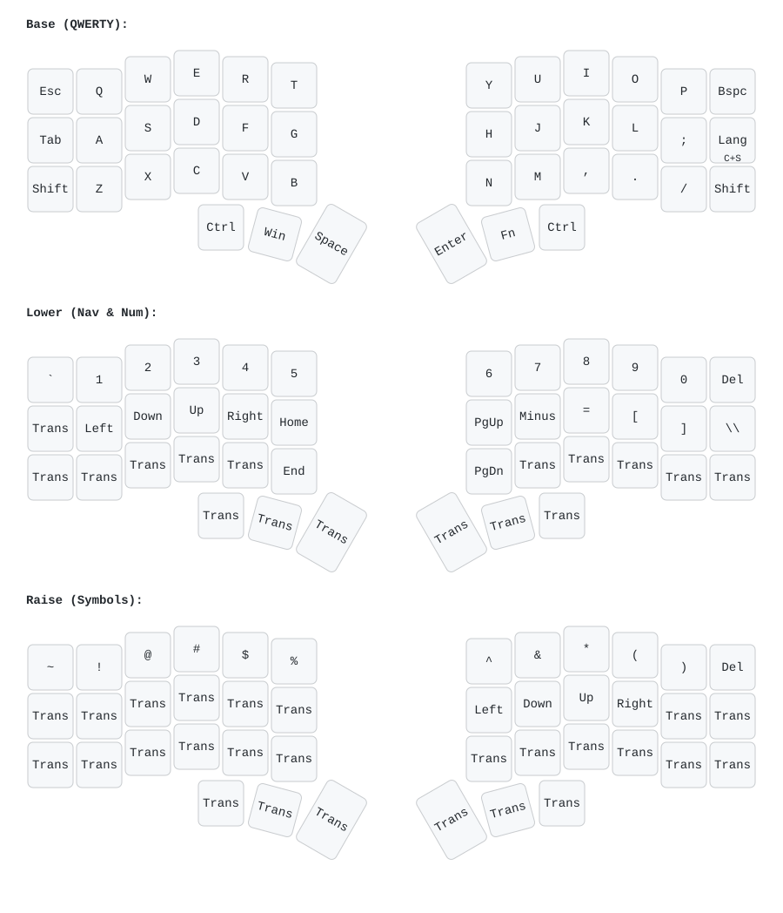

# Corne Wireless (W-Corne / DH747) Keyboard Setup & Notes

Documentation and declarative configuration for the **W-Corne (DH747)** split ergonomic keyboard.



---

## 1. Repository Structure

* `keymap.yaml` — Declarative definition of all layers (QWERTY, Lower, Raise) rendered via `keymap-drawer`.
* `.github/workflows/draw.yml` — GitHub Action that automatically regenerates `keymap.svg` on every push.
* `layout.json` — Matrix layout with QMK keycodes for programming the hardware directly.
* `apply_layout.sh` — Pure Bash script applying `layout.json` to the keyboard via the `vitaly` CLI and `jq`.

---

## 2. Hardware Architecture

* **Form Factor:** Corne (CRKBD) split layout (3x6 column-staggered + 3 thumb keys per half + 2 extra vertical macro keys).
* **Connectivity:** Fully wireless to PC via a dedicated 2.4 GHz USB Dongle (Receiver).
* **Power:** Autonomous battery power (CR2032 coin cells / internal battery). No external USB port on the halves.
* **Roles:**
  * **USB Dongle (Host / Central):** Microcontroller (Nordic nRF52840 / Seeed XIAO BLE) connected via USB to your computer. It receives wireless packets from both halves, manages keymaps, layers, macros, and combos, and sends standard USB HID keystrokes to the OS.
  * **Left & Right Halves (Peripherals):** Scan key switch matrices and transmit press events over radio to the dongle.

---

## 3. Language Switching (RU / EN)

In `layout.json`, the right-half Row 2 outer key (where the Enter keycap is located) is mapped to **`Ctrl + Shift`** (`C(KC_LSFT)`).

To use this for layout switching in **Hyprland / NixOS**, configure:

```lua
-- In hyprland.lua (or hyprland input config)
hl.config({
  input = {
    kb_layout = "us,ru",
    kb_options = "grp:ctrl_shift_toggle",
  },
})
```

Now pressing that key triggers a clean language switch with a single finger.

---

## 4. Battery & Hardware Diagnostics

### Symptoms of Low Battery:
* Skipped keystrokes, chatter, or delayed response.
* One half suddenly stops responding (the left half usually drains faster as it transmits more service packets).

### Battery Verification:
1. **CR2032 Voltage:**
   * Nominal: `3.0V`.
   * Unstable radio threshold: below `2.8V - 2.7V`.
2. **Replacement Checklist:**
   * Remove any protective plastic film on the negative terminal of new batteries.
   * Verify polarity: positive (`+`, smooth side with label) faces upward.
   * Ensure battery spring contacts are firm.
   * Check physical power switches on each half.
   * If a half hangs after battery insertion, click the onboard **Reset** button.

---

## 5. Linux / NixOS Diagnostics

### Check USB Dongle:
```bash
nix-shell -p usbutils --run lsusb
# or
sudo dmesg -T | tail -n 30
```

### Serial CDC Logs & Battery Levels:
Most ZMK / Vial dongles expose a virtual serial interface:
```bash
# List serial devices
ls -l /dev/ttyACM*

# Read live logs and battery status (exit: Ctrl+A, then Ctrl+X)
nix-shell -p picocom --run "picocom -b 115200 /dev/ttyACM0"
```
The console prints connection states and battery percentages (`left battery: XX%`, `right battery: XX%`).

### Live Event Debugging:
```bash
sudo evtest
# or
sudo libinput debug-events
```

---

## 6. Applying Layout via CLI

1. Ensure `vitaly` and `jq` are available in your environment (or use Nix):
   ```bash
   nix-shell -p jq --run ./apply_layout.sh
   ```
2. The script applies every key in `layout.json` to Layer 0 on the keyboard via the Vial HID protocol.
